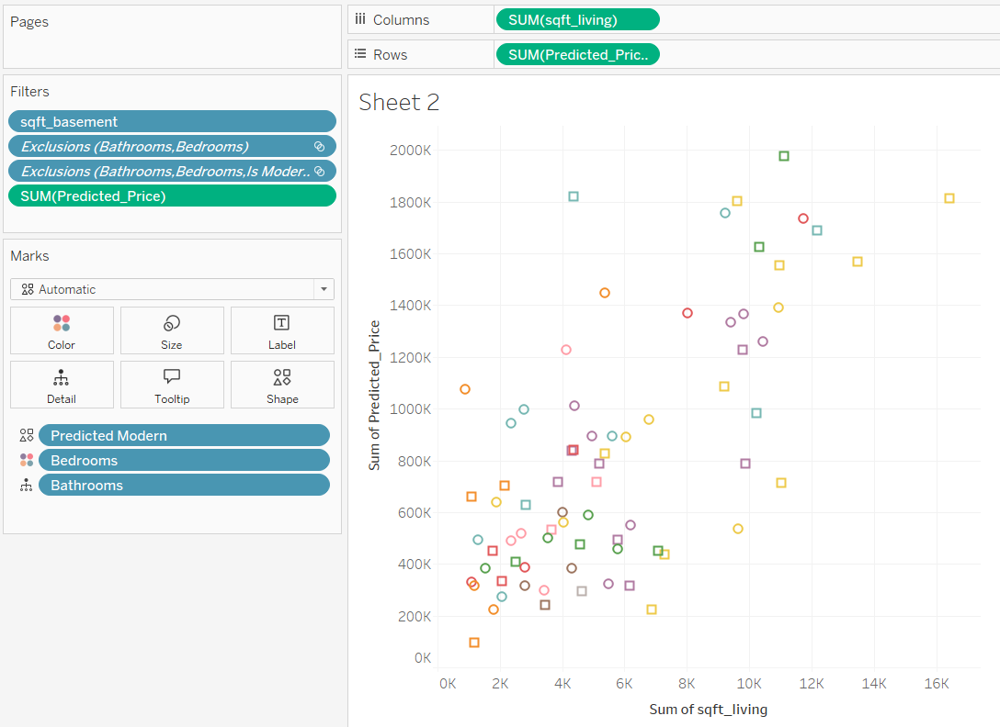

# House Sales Prediction and Classification
# House-Value-Estimator
I will be using the House Sales in King County, USA dataset. I will try to train a model to predict the price of a house given information about its attributes on rooms and how big the house is.

## Dataset
Source: https://www.kaggle.com/datasets/harlfoxem/housesalesprediction/data
Contains house sale prices and related attributes, such as bedrooms, bathrooms, square footage, etc.

# ML Workflow
## Data Loading
- Used ```pandas``` to load dataset (```kc_house_data.csv```)
- Verified data integrity by displaying a few rows

## Feature Selection

Target: ```price```
Selected Features include: ```Bedrooms```, ```Bathrooms```, ```sqft_living```, ```sqft_lot```, ```floors```, ```grade``` and etc

Data Splitting
- Split the data into training 75% and test 25% sets using ```train_test_split```.

Linear Regression 
- Model Linear Regression ```sklearn```
Evluation Metrics:
- Mean Squared Error (MSE): ~48.56B
- R^2 Score: ~0.65

## Data Visualization - Tableau



Each point in the scatter plot represents a house, color-coded by different attributes like ```Bedrooms```, ```Bathrooms``` and ```Predicted Modern Houses``` This chart helps to analyze the trend whether homes tend to have higher predicted prices depending on how big the home is to begin with.